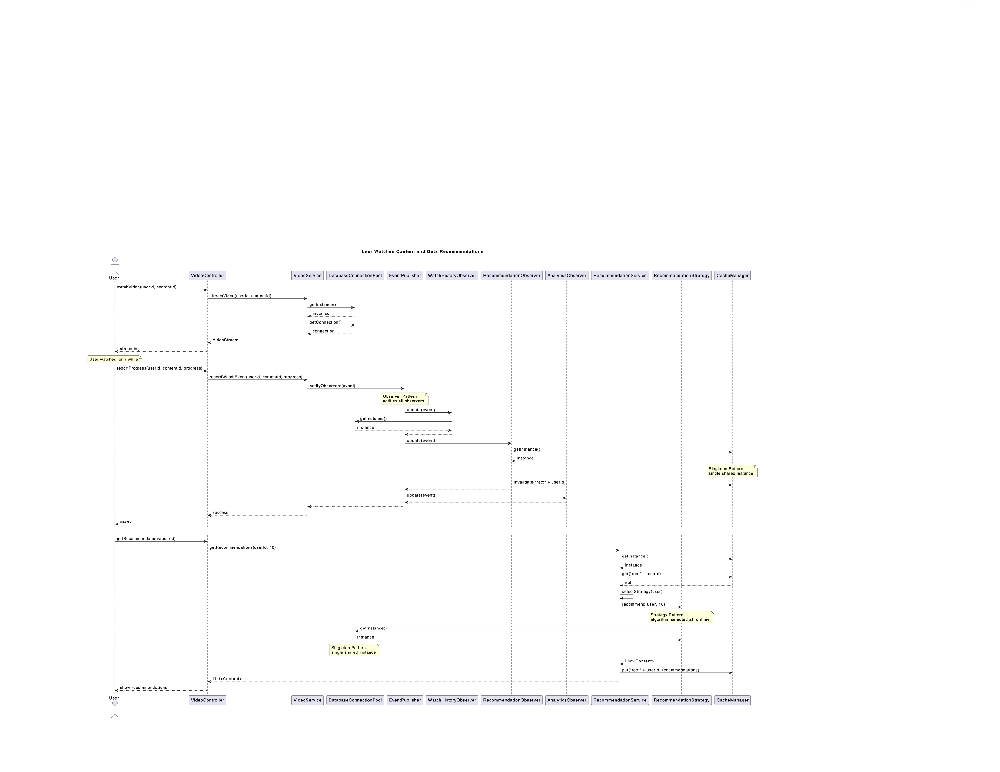
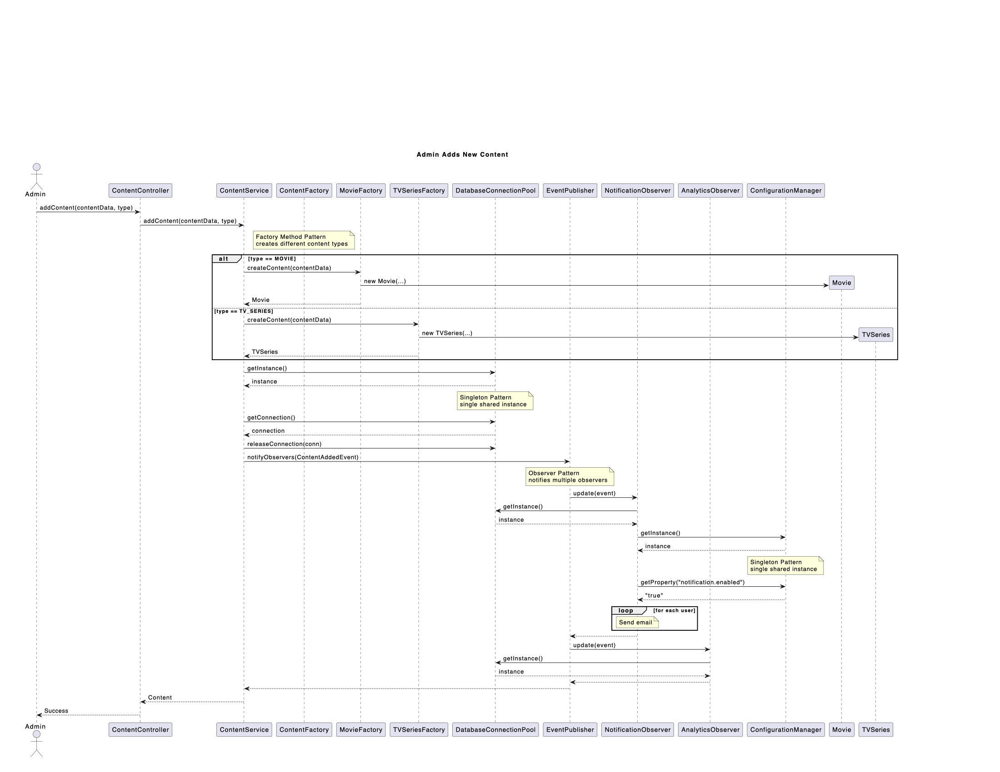

# StreamFlix — SDT Project
Team: Bilciurescu Elena-Alina, Solomon Miruna-Maria, Toma Daria-Maria (1241EA)

Group 1241EA CTI-E.

This repository contains a proof‑of‑concept (Milestone 2) Spring Boot application demonstrating four non‑trivial design patterns (Factory Method, Strategy, Observer, Singleton) for a video streaming platform.

## How to run (POC)
- Java 11+, Maven
- Start: `mvn spring-boot:run -DskipTests`
- UI: http://localhost:8080/
- H2 Console: http://localhost:8080/h2-console (JDBC: `jdbc:h2:mem:streamflix`, user `sa`, password empty)

## Milestone 2 quick links
- Class diagram: `docs/diagrams/ClassDiagram.png`
- Sequence (watch + recommend): `docs/diagrams/SeqDiagram1.png`
- Sequence (add content): `docs/diagrams/SeqDiagram2.png`

---

# Milestone 2 — Design and Implementation

## UML Diagrams

### Class Diagram
The class diagram shows all four design patterns integrated into the StreamFlix architecture. Each pattern is annotated directly on the diagram over the relevant participants.

**Patterns demonstrated:**
- **Factory Method**: `ContentFactory` interface with `MovieFactory` and `TVSeriesFactory` implementations
- **Strategy**: `RecommendationStrategy` interface with three concrete strategies
- **Observer**: `EventPublisher` with multiple observers reacting to system events
- **Singleton**: `DatabaseConnectionPool`, `CacheManager`, and `ConfigurationManager`


### Sequence Diagrams

#### Sequence Diagram 1: User Watches Content and Gets Recommendations
This diagram illustrates the main user workflow showing:
1. User streams video content
2. Progress is recorded and triggers `VideoWatchedEvent`
3. Multiple observers react in parallel (Observer Pattern)
4. User requests recommendations
5. Strategy is selected based on user state (Strategy Pattern)
6. Singleton resources are accessed throughout

**Patterns demonstrated:** Observer, Strategy, Singleton



#### Sequence Diagram 2: Admin Adds New Content
This diagram shows the content management workflow:
1. Admin adds new content via API
2. Appropriate factory creates Movie or TVSeries (Factory Method Pattern)
3. Content is persisted to database
4. `ContentAddedEvent` is published (Observer Pattern)
5. Observers send notifications and initialize analytics

**Patterns demonstrated:** Factory Method, Observer, Singleton



## Implementation Overview

### Project Structure
```
src/main/java/com/streamflix/
├── model/
│   ├── content/         # Content, Movie, TVSeries, Episode
│   ├── user/            # User, Profile, SubscriptionTier
│   └── events/          # Event hierarchy
├── factory/             # Factory Method pattern
│   ├── ContentFactory
│   ├── MovieFactory
│   └── TVSeriesFactory
├── strategy/            # Strategy pattern
│   ├── RecommendationStrategy
│   ├── TrendingStrategy
│   ├── HistoryBasedStrategy
│   └── RatingBasedStrategy
├── observer/            # Observer pattern
│   ├── EventPublisher
│   ├── EventObserver
│   └── observers/       # Concrete observers
├── singleton/           # Singleton pattern
│   ├── DatabaseConnectionPool
│   ├── CacheManager
│   └── ConfigurationManager
└── service/
    ├── ContentService
    ├── VideoService
    └── RecommendationService
```

### Pattern Interactions

The patterns work together cohesively:

1. **Factory Method → Observer**: When `ContentService` creates content using factories, it publishes `ContentAddedEvent` through the Observer pattern
2. **Observer → Strategy**: When users watch content, `RecommendationObserver` invalidates cached recommendations, forcing the Strategy pattern to recompute with fresh data
3. **Singleton → All Patterns**: All services and observers use `DatabaseConnectionPool` for persistence and `CacheManager` for performance
4. **Strategy → Observer**: Recommendation strategies analyze data collected by `WatchHistoryObserver` and `AnalyticsObserver`

### Key Implementation Details

**Factory Method Pattern:**
- Creates `Movie` and `TVSeries` objects without conditional logic
- Easy to extend with new content types (Documentaries, Podcasts)
- Example: `ContentService.addContent()` uses the factory pattern

**Strategy Pattern:**
- Three algorithms: `TrendingStrategy` (new users), `HistoryBasedStrategy` (returning users), `RatingBasedStrategy` (users with ratings)
- Strategy selection in `RecommendationService.selectStrategy()` based on user data
- Easy A/B testing by swapping strategies

**Observer Pattern:**
- Four observers: `WatchHistoryObserver`, `RecommendationObserver`, `AnalyticsObserver`, `NotificationObserver`
- Asynchronous event processing doesn't block main operations
- Adding new observers (e.g., achievement tracking) requires no changes to publishers

**Singleton Pattern:**
- `DatabaseConnectionPool`: manages 20 connections shared across all services
- `CacheManager`: single Redis cache instance for all services
- `ConfigurationManager`: loads config once and provides consistent values
- Thread-safe lazy initialization with double-checked locking

### Proof of Concept Scope

This implementation focuses on demonstrating pattern interactions rather than building a complete system:

**Implemented:**
-  All four design patterns with proper integration
-  Content creation and retrieval
-  Event publishing and observer notifications
-  Recommendation generation with strategy selection
-  Singleton resource sharing
-  Basic REST API endpoints
-  In-memory H2 database

**Not implemented (out of scope for POC):**
-  JWT authentication
-  Video file storage/streaming
-  Production-ready caching
-  Email notification sending
-  Complete subscription management
-  Frontend UI


# Milestone 1 — Project description and pattern selection

## StreamFlix - Video Streaming Platform

### Team Members
1. **BILCIURESCU ELENA-ALINA** - 1241EA
2. **SOLOMON MIRUNA-MARIA** - 1241EA
3. **TOMA DARIA-MARIA** - 1241EA

### Project Description
StreamFlix is a video streaming platform similar to Netflix that allows users to browse, watch, and rate video content. The platform supports user authentication, multiple subscription tiers, content management, personalized recommendations, and real-time notifications.

#### Core Features
- User Management: registration/authentication (JWT planned), subscription tiers
- Content Catalog: Movies and TV Series, search/browse, trending
- Video Streaming: continuation and watch history (POC simulates events)
- Recommendation System: strategies for new/returning users
- Rating System: 1–5 stars, ratings impact recs
- Notification System: simulated observer for events

### Design Patterns
1. Factory Method — creates different content types (Movie/TVSeries) without conditionals scattered across code.
2. Strategy — interchangeable recommendation algorithms (Trending, History, Rating) selected at runtime.
3. Observer — decoupled reactions to events (watch/rate) by multiple observers (history, analytics, notifications).
4. Singleton — single instances for shared resources (DB pool, cache, configuration).

For additional information, please refer to the README on the [1-teams-and-project-description branch](https://github.com/Daria1810/SDT_Project/tree/1-teams-and-project-description).

